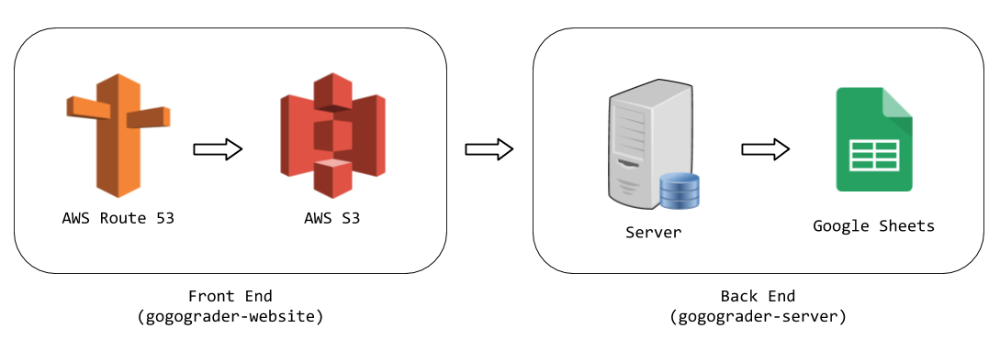

# GoGoGrader Server

Backend for the GoGoGrader website, built with Go.

## Entire Project Structure

## Quickstart

### Setup
1. Create a Google Cloud service account with Google Sheets API edit credentials
2. Download the service account's client secret file, and put it in the `config/` folder with the name `client_secret.json`
3. Share the appropriate sheets with the service account
4. Copy the IDs of the above sheets into their respective places in `config/config.json`

### Running in Dev
1. Make sure you have Golang installed on the server
2. `go run main.go`

### Running in Prod
1. Make sure you have Golang installed on the server
2. `go build main.go`
3. `./main`

## Development
This project makes heavy use of [gorilla/mux](https://github.com/gorilla/mux) for routing and [Iwark/spreadsheet](https://github.com/Iwark/spreadsheet) for Google Sheets API calls.

### File Structure
- `/config/config.json`: Configuration file to specify port and Google Sheet URLs to use
- `main.go`: Root code file, initializes routes and starts server.
- `/auth`: Code for authorization, including logging in and storing session IDs
- `/db`: Interfacing with our database (in this case, Google Sheets)
- `/routes`: Handlers for each API route
- `/util`: Helper functions for the entire project
